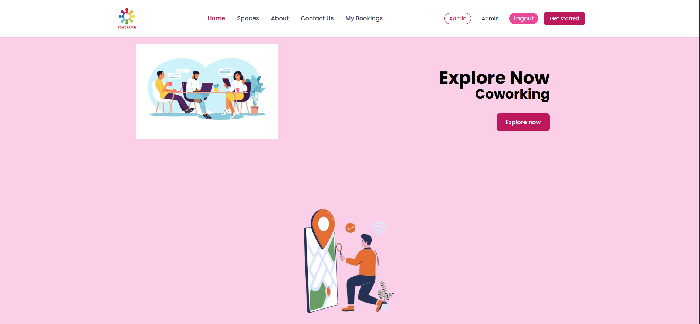
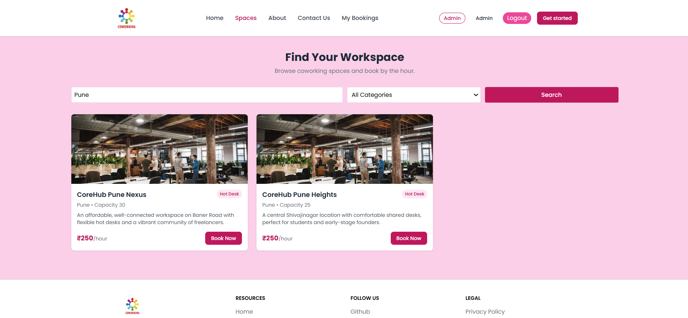
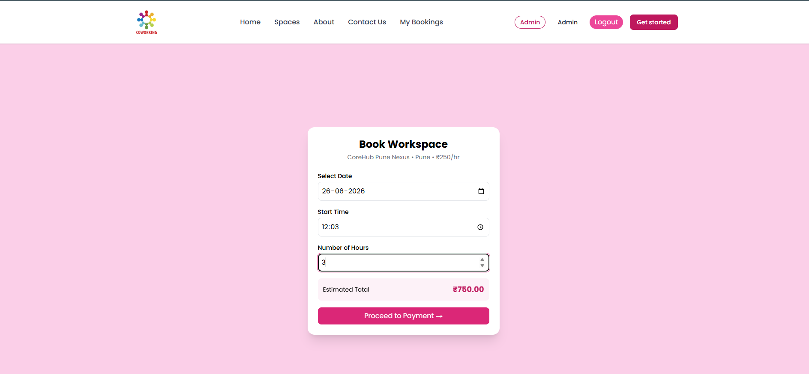
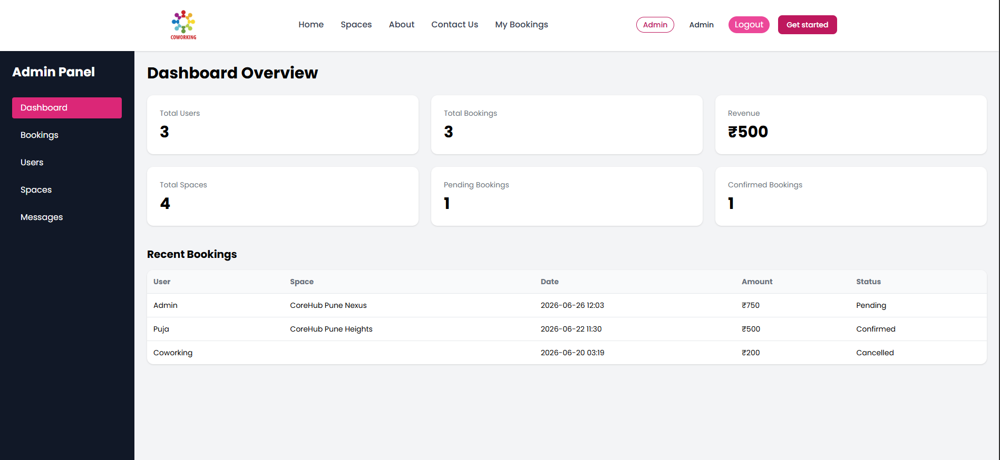

# 🚀 Coworking Space Booking Platform

A full-stack coworking space booking platform that enables users to discover coworking spaces, check real-time availability, book workspaces by the hour, and manage reservations seamlessly.

Designed and developed as a production-ready MERN application featuring secure authentication, role-based access control, booking management, email services, image uploads, and a comprehensive admin dashboard.

---

## ✨ Key Features

### 👤 User Features

* JWT-based Authentication
* User Registration & Login
* Forgot & Reset Password via Email
* Browse & Search Coworking Spaces
* Real-Time Availability Checking
* Hourly Workspace Booking
* Booking Conflict Prevention
* Mock Payment Integration
* Booking History & Cancellation
* Contact Support via Email

### 🛠️ Admin Features

* Admin Dashboard with Platform Statistics
* User Management (Promote/Demote Roles)
* Space Management (Create, Read, Update, Delete)
* Workspace Image Uploads
* Booking Management
* Reservation Confirmation & Cancellation

---

## 🛠️ Tech Stack

### Frontend

* React.js
* Redux Toolkit
* React Router
* Axios
* Vite

### Backend

* Node.js
* Express.js
* MongoDB Atlas
* Mongoose
* JWT Authentication
* Nodemailer
* Multer

---

## 🏗️ Architecture

```text
React + Redux Frontend
          │
          ▼
Express.js REST API
          │
          ▼
MongoDB Atlas Database
```

---

## 💡 Challenges Solved

### Real-Time Booking Validation

Implemented booking conflict detection to prevent overlapping reservations for the same workspace and time slot.

### Secure Authentication

Built JWT-based authentication with protected routes and password reset functionality using email verification.

### Role-Based Access Control

Created separate authorization flows for users and administrators to ensure secure resource management.

### File Upload Management

Integrated Multer for workspace image uploads and storage.

---

## 📸 Screenshots

### 🏠 Home Page



### 🔍 Space Listings



### 📅 Booking Flow



### ⚙️ Admin Dashboard



---

## 🚀 Installation

### Backend Setup

```bash
cd CoworkingBackend/Coworkingbackend

npm install

npm run seed

npm run dev
```

### Frontend Setup

```bash
cd CoworkingFrontend

npm install

npm run dev
```

---

## 📂 Project Structure

```text
CoworkingBackend/
└── Coworkingbackend/
    ├── Controllers/
    ├── Models/
    ├── Routes/
    ├── Middleware/
    ├── uploads/
    └── server.js

CoworkingFrontend/
├── public/
├── src/
└── vite.config.js
```

---


## 🔮 Future Improvements

* Stripe/Razorpay Integration
* Google OAuth Authentication
* Workspace Reviews & Ratings
* Cloudinary/S3 Image Storage
* Real-Time Notifications
* Analytics Dashboard
* Multi-Vendor Support

---

## 👨‍💻 Developer

Built using the MERN Stack to demonstrate full-stack application development, REST API design, authentication and authorization, booking workflow management, database modeling, file uploads, email integration, and deployment-ready architecture.

This project showcases practical experience in developing scalable web applications with modern frontend and backend technologies.
